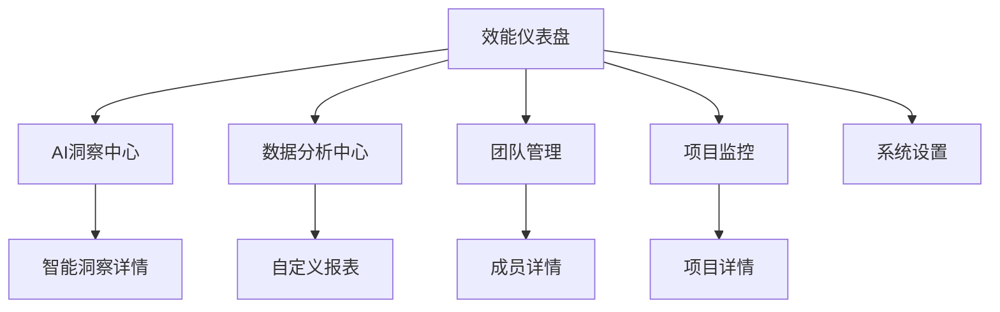

## 1. 产品概览

AI驱动的软件开发效能管理平台是一个基于VSM+框架的智能化效能度量系统，通过AI技术自动采集、分析和可视化软件开发过程中的数据。

该平台旨在解决传统效能度量中的"人工税"问题，通过自动化数据采集与整合、智能化分析与洞察、实时反馈与主动干预，大幅降低VSM+框架的实施成本，让任何规模的团队都能获得数据驱动的价值交付能力。

## 2. 核心功能

### 2.1 用户角色

| 角色 | 注册方式 | 核心权限 |
|------|----------|----------|
| 开发者 | 邮箱注册 | 查看个人效能数据、团队协作指标、AI建议 |
| 团队负责人 | 邀请码注册 | 管理团队成员、查看团队效能报告、设置目标 |
| 项目经理 | 管理员分配 | 跨团队数据查看、项目进度监控、资源分配 |
| 系统管理员 | 系统预设 | 平台配置、数据源集成、用户权限管理 |

### 2.2 功能模块

我们的AI驱动软件开发效能管理平台包含以下核心页面：

1. **效能仪表盘**：DORA指标展示、流动效率监控、团队效能排行、实时活动流
2. **AI洞察中心**：智能洞察生成、改进建议推荐、预测性分析、AI问答助手
3. **数据分析中心**：多维度数据分析、自定义报表、趋势对比、根因分析
4. **团队管理**：团队效能评估、成员贡献分析、技能雷达图、协作模式分析
5. **项目监控**：项目健康度评估、风险预警、进度跟踪、资源利用率
6. **系统设置**：数据源配置、AI模型调优、告警规则设置、权限管理

### 2.3 页面详情

| 页面名称 | 模块名称 | 功能描述 |
|----------|----------|----------|
| 效能仪表盘 | DORA指标卡片 | 展示部署频率、变更前置时间、变更失败率、平均恢复时间的实时数据和趋势 |
| 效能仪表盘 | 流动效率监控 | 显示流动效率、在制品数量、周期时间、吞吐量等关键流动指标 |
| 效能仪表盘 | 团队效能排行 | 基于综合效能评分的团队排名，包含趋势变化和进度条 |
| 效能仪表盘 | 实时活动流 | 展示部署、提交、事件等开发活动的时间线和状态 |
| AI洞察中心 | 智能洞察生成 | AI自动分析效能数据，生成洞察报告，包含置信度和影响评估 |
| AI洞察中心 | 改进建议推荐 | 基于数据分析提供具体的改进建议，包含优先级和实施计划 |
| AI洞察中心 | 预测性分析 | 利用机器学习预测未来趋势，识别潜在瓶颈和风险 |
| AI洞察中心 | AI问答助手 | 自然语言交互，回答效能相关问题，提供个性化建议 |
| 数据分析中心 | 多维度分析 | 支持按时间、团队、项目等维度进行数据切片和对比分析 |
| 数据分析中心 | 自定义报表 | 用户可自定义指标组合，生成个性化的效能报表 |
| 数据分析中心 | 趋势对比 | 历史数据对比分析，识别长期趋势和周期性模式 |
| 数据分析中心 | 根因分析 | AI驱动的自动根因分析，快速定位问题源头 |
| 团队管理 | 团队效能评估 | 综合评估团队在速度、质量、协作等维度的表现 |
| 团队管理 | 成员贡献分析 | 分析个人贡献度、技能分布、成长轨迹 |
| 团队管理 | 技能雷达图 | 可视化展示团队技能分布和能力缺口 |
| 团队管理 | 协作模式分析 | 分析团队协作模式，识别最佳实践和改进机会 |
| 项目监控 | 项目健康度评估 | 基于多个指标综合评估项目健康状况 |
| 项目监控 | 风险预警 | AI预测项目风险，提前发出预警和建议 |
| 项目监控 | 进度跟踪 | 实时跟踪项目进度，对比计划与实际执行情况 |
| 项目监控 | 资源利用率 | 监控团队资源分配和利用效率 |
| 系统设置 | 数据源配置 | 配置Git、Jira、CI/CD等工具的数据连接器 |
| 系统设置 | AI模型调优 | 调整AI分析模型参数，优化洞察质量 |
| 系统设置 | 告警规则设置 | 设置各类指标的阈值和告警规则 |
| 系统设置 | 权限管理 | 管理用户角色和数据访问权限 |

## 3. 核心流程

### 管理员流程
管理员首先进入系统设置页面配置数据源连接器（Git、Jira、CI/CD工具等），然后设置AI模型参数和告警规则，最后分配用户权限。配置完成后，系统开始自动采集和分析数据。

### 团队负责人流程
团队负责人登录后查看效能仪表盘了解团队整体表现，然后进入AI洞察中心查看智能分析结果和改进建议，接着在团队管理页面深入分析成员表现和协作模式，最后根据洞察制定改进计划。

### 开发者流程
开发者可以查看个人效能数据和团队协作指标，通过AI问答助手获取个性化建议，参与团队效能改进活动。

## 4. 用户界面设计

### 4.1 设计风格

- **主色调**：科技蓝 (#1890ff) 和智能紫 (#722ed1)
- **辅助色**：成功绿 (#52c41a)、警告橙 (#faad14)、错误红 (#f5222d)
- **按钮风格**：现代化圆角设计，支持悬停和点击动效
- **字体**：主要使用 -apple-system, BlinkMacSystemFont, 'Segoe UI'，标题 16-24px，正文 14px
- **布局风格**：卡片式布局，左侧导航栏，顶部面包屑导航
- **图标风格**：使用 Ant Design 图标库，简洁现代的线性图标

### 4.2 页面设计概览

| 页面名称 | 模块名称 | UI元素 |
|----------|----------|--------|
| 效能仪表盘 | DORA指标卡片 | 统计卡片、趋势图表、颜色编码的状态指示器、实时数据更新动画 |
| 效能仪表盘 | 流动效率监控 | 环形进度图、折线图、数据对比表格、趋势箭头图标 |
| AI洞察中心 | 智能洞察生成 | 洞察卡片、置信度进度条、严重程度标签、时间轴展示 |
| AI洞察中心 | AI问答助手 | 聊天界面、消息气泡、输入框、发送按钮、历史对话记录 |
| 数据分析中心 | 多维度分析 | 交互式图表、筛选器、数据表格、导出按钮、时间选择器 |
| 团队管理 | 技能雷达图 | 雷达图表、技能标签、成员头像、评分滑块、对比视图 |
| 项目监控 | 项目健康度 | 健康度仪表盘、风险警告标识、进度条、状态徽章、预警图标 |
| 系统设置 | 数据源配置 | 连接器卡片、配置表单、测试连接按钮、状态指示灯、日志查看器 |

### 4.3 响应式设计

平台采用桌面优先的响应式设计，支持移动端自适应。在移动设备上，侧边栏收缩为抽屉式导航，图表自动调整为适合触摸操作的尺寸，确保在各种设备上都有良好的用户体验。